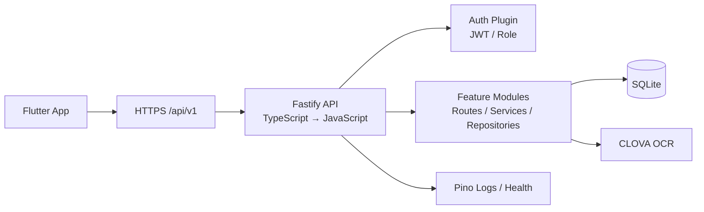

# Odin Guild API 백엔드 아키텍처

> 상태: 기준안
>
> 기준일: 2026-08-10
>
> 기준 프로젝트: `odin_boss_schedule`
>
> 클라이언트: `/Applications/XAMPP/xamppfiles/htdocs/my-prj/odin_guild_app`

## 1. 문서 목적

이 문서는 Odin Guild 앱의 Fastify 백엔드에서 지켜야 할 구조, API 계약, 데이터 저장, 보안, 운영, 테스트 기준을 정의한다.

새 기능을 추가하거나 기존 기능을 수정할 때 이 문서를 먼저 확인한다. 구현과 문서가 달라지는 경우에는 구현만 끝내지 말고 이 문서의 해당 절을 함께 갱신한다.

## 2. 기술 선택

| 영역            | 결정                                                   | 이유                                                                                                                                                                    |
| --------------- | ------------------------------------------------------ | ----------------------------------------------------------------------------------------------------------------------------------------------------------------------- |
| 런타임          | Node.js LTS                                            | Flutter 앱과 분리된 API 서버를 구성하고 기존 Node 생태계와 연동하기 쉽다.                                                                                               |
| 언어            | TypeScript                                             | 일정·투표·컬렉션처럼 DTO와 권한이 많은 도메인의 필드 오류를 줄인다. 빌드 후 운영 런타임에는 JavaScript만 배포한다.                                                      |
| HTTP 프레임워크 | Fastify v5                                             | 낮은 오버헤드, schema 기반 검증·직렬화, plugin 구조를 사용한다.                                                                                                         |
| API 계약        | TypeBox schema + 아키텍처 문서 + route/contract test   | 별도 문서 UI 없이 코드의 schema와 테스트를 API 계약의 기준으로 사용한다.                                                                                                |
| 인증            | JWT access token + bcrypt 계열 해시                    | 현재 앱의 인증 흐름을 유지하되 서버에서 역할과 만료를 검증한다.                                                                                                         |
| 데이터베이스    | SQLite                                                 | Naver Cloud Micro의 단일 서버·소규모 길드 운영에 적합하다.                                                                                                              |
| DB 접근         | SQL Repository + `better-sqlite3` + prepared statement | JPA/Hibernate 같은 무거운 ORM을 사용하지 않고 쿼리와 transaction 경계를 명확히 한다. 짧은 SQLite 작업만 동기 실행하고 외부 네트워크 호출은 transaction 밖에서 처리한다. |
| 외부 OCR        | 서버의 `fetch` 기반 CLOVA OCR client                   | OCR secret과 template 설정을 Flutter에 노출하지 않는다.                                                                                                                 |
| 프로세스        | 단일 Fastify process                                   | SQLite 파일 잠금과 Micro 자원 제한을 고려한다. cluster/PM2 cluster는 사용하지 않는다.                                                                                   |

Fastify의 공식 문서와 plugin 목록은 [Fastify 공식 사이트](https://fastify.dev/)와 [Ecosystem](https://fastify.dev/docs/latest/Guides/Ecosystem/)을 기준으로 확인한다. 주요 패키지의 버전은 설치 시점의 호환 가능한 최신 버전을 사용하되, major 버전 변경은 이 문서의 기술 선택 절을 갱신한다.

## 3. 범위

### 3.1 포함

- 로그인, 초대 가입, 내 정보, 역할 관리
- 길드원·길드 설정
- 보스 정의와 보스 일정
- 보스 참여 대상과 참여 현황
- 보스 참여 투표, 마감·삭제, 기간별 통계
- 공지·가격표·보스 통제
- 손지원 요청·신청·매칭
- 컬렉션 V2
- 콘텐츠 그룹
- 공성전 현황
- CLOVA OCR 일정 분석 proxy
- 보스 참여 이력의 날짜별 보존과 자동 정리

### 3.2 제외

- Flutter 화면과 정적 웹 파일 제공
- Discord bot 및 Discord 알림
- 짱깸보 기능
- 클라이언트의 DB 직접 접근
- 초기 단계의 WebSocket/SSE 실시간 동기화

실시간 동기화가 필요해지면 먼저 polling으로 해결 가능한지 확인하고, SSE/WebSocket 도입 비용과 Micro 서버 부하를 문서의 결정 로그에 기록한다.

## 4. 전체 구조



### 4.1 실행 경계

- `src/app.ts`: Fastify instance를 만들고 plugin·route를 등록한다. `listen`하지 않는다.
- `src/server.ts`: 환경을 로드하고 `app.ts`를 생성한 뒤 실제 포트를 열고 graceful shutdown을 처리한다.
- 테스트는 `src/app.ts`를 import하여 실제 포트를 열지 않고 `fastify.inject()`로 실행한다.
- API 서버는 Flutter 앱만 대상으로 하며 `@fastify/static`을 사용하지 않는다.
- TLS 종료와 public `80/443` 처리는 Nginx 또는 Naver Cloud의 HTTPS 계층에서 담당한다.

### 4.2 요청 흐름

```text
HTTP 요청
  → request-id / logger
  → CORS / body limit
  → JWT 인증
  → role/permission hook
  → route schema 검증
  → service/use case
  → repository transaction
  → response DTO 직렬화
  → 공통 에러·로그 처리
```

Route handler에서 SQL을 실행하거나 외부 OCR을 직접 호출하지 않는다.

## 5. 디렉터리 구조

```text
odin_guild_api/
├── AGENTS.md
├── docs/
│   └── backend-architecture.md
├── package.json
├── tsconfig.json
├── .env.example
├── src/
│   ├── server.ts
│   ├── app.ts
│   ├── config/
│   │   ├── env.ts
│   │   └── constants.ts
│   ├── plugins/
│   │   ├── auth.plugin.ts
│   │   ├── cors.plugin.ts
│   │   ├── error.plugin.ts
│   │   └── request-context.plugin.ts
│   ├── shared/
│   │   ├── errors/
│   │   ├── http/
│   │   ├── permissions/
│   │   ├── time/
│   │   └── validation/
│   ├── infrastructure/
│   │   ├── db/
│   │   │   ├── client.ts
│   │   │   ├── migrations/
│   │   │   └── transaction.ts
│   │   └── external/
│   │       └── clova-ocr.client.ts
│   └── modules/
│       ├── auth/
│       ├── guild/
│       ├── members/
│       ├── bosses/
│       ├── schedules/
│       ├── boss-votes/
│       ├── notices/
│       ├── support/
│       ├── collections/
│       ├── content-groups/
│       ├── siege/
│       └── ocr/
├── test/
│   ├── unit/
│   ├── routes/
│   ├── integration/
│   └── fixtures/
└── ops/
    ├── systemd/
    ├── nginx/
    └── backup/
```

각 module은 다음 구조를 기본으로 한다.

```text
modules/schedules/
├── schedules.route.ts       # URL, auth 연결, request/reply 변환
├── schedules.schema.ts      # TypeBox/JSON Schema
├── schedules.service.ts     # 업무 규칙과 transaction 조합
├── schedules.repository.ts  # SQL, row mapping
├── schedules.types.ts       # domain/type
└── index.ts                 # module registration
```

### 5.1 계층별 규칙

| 계층           | 책임                                            | 금지 사항                  |
| -------------- | ----------------------------------------------- | -------------------------- |
| route          | HTTP 입출력, schema, 인증 hook 연결             | SQL, 복잡한 업무 규칙      |
| schema         | 입력·출력 형식, 길이·범위 검증                  | DB 조회로 권한 판단        |
| service        | 업무 규칙, 권한 조건, transaction orchestration | HTTP 객체 의존             |
| repository     | SQL, prepared statement, row↔domain 변환        | HTTP status 결정           |
| infrastructure | DB·OCR·파일·시계 같은 외부 자원                 | 도메인 정책 결정           |
| domain/types   | 상태 전이, 값 객체, 불변 규칙                   | Fastify request/reply 의존 |

## 6. 모듈 경계

| Module           | 책임                                 | 주요 데이터                                               |
| ---------------- | ------------------------------------ | --------------------------------------------------------- |
| `auth`           | 로그인, 가입, JWT, 초대 token        | users, invites                                            |
| `guild`          | 길드명, 운영 정책, 서버 시간         | guild_settings                                            |
| `members`        | 길드원 목록, 역할, 프로필            | users, characters                                         |
| `bosses`         | 보스 정의와 순서                     | custom_bosses                                             |
| `schedules`      | 현재 일정, 컷·멍, 일정 입력          | boss_schedules, schedule_history                          |
| `boss-votes`     | 투표 이벤트, 참여자, 마감·삭제, 통계 | vote_events, vote_participants, vote_states, vote_history |
| `notices`        | 규칙, 가격표, 보스 통제              | notice_rules, price_guides, price_items, boss_controls    |
| `support`        | 손지원 요청·신청·매칭                | support_requests, support_applications                    |
| `collections`    | 컬렉션 정의와 V2 체크 상태           | collection_items, user_collections, excluded_members      |
| `content-groups` | 콘텐츠 그룹과 배치                   | content_groups, group_members                             |
| `siege`          | 공성전 참여와 다이아                 | siege_records                                             |
| `ocr`            | OCR template 조회·이미지 분석 proxy  | 외부 API 결과, 파일 미저장                                |

모듈 사이에서 repository를 직접 호출하지 않는다. 다른 모듈의 데이터가 필요하면 해당 모듈이 제공하는 service/query interface를 호출하고, 순환 의존성이 생기면 공통 query 또는 별도 application service로 분리한다.

## 7. API 계약

### 7.1 경로와 명명

- 모든 신규 endpoint는 `/api/v1` prefix를 사용한다.
- 리소스는 복수형 명사를 사용한다. 예: `/api/v1/schedules`.
- 명령형 동작은 리소스 하위 action으로 제한한다. 예: `/api/v1/schedules/:id/cut`.
- DB 컬럼은 `snake_case`, JSON 필드는 `camelCase`를 사용한다.
- 시간은 저장·전송 모두 Unix epoch milliseconds를 기본으로 한다. 사람이 읽는 날짜는 클라이언트에서 Asia/Seoul로 표시한다.
- ID는 숫자라도 JSON 계약에서는 string으로 바꾸지 않고 실제 타입을 문서에 고정한다. `voteKey`처럼 복합 식별자는 string으로 둔다.

### 7.2 기본 응답

성공 응답은 가능한 한 `data` 아래에 결과를 넣는다.

```json
{
  "data": {
    "id": 1,
    "name": "파르바"
  }
}
```

목록 응답은 pagination을 확장할 수 있는 형태로 만든다.

```json
{
  "data": [],
  "meta": {
    "page": 1,
    "pageSize": 50,
    "total": 0
  }
}
```

### 7.3 오류 응답

모든 오류는 안정적인 `code`를 갖는다.

```json
{
  "error": {
    "code": "SCHEDULE_NOT_FOUND",
    "message": "보스 일정을 찾을 수 없습니다.",
    "details": null,
    "requestId": "req_01..."
  }
}
```

권장 상태 코드:

| 상태  | 용도                            |
| ----- | ------------------------------- |
| `400` | JSON 형식·입력값 오류           |
| `401` | token 없음·만료·위조            |
| `403` | 역할·정책상 권한 부족           |
| `404` | 리소스 없음                     |
| `409` | 중복·상태 충돌                  |
| `422` | 형식은 맞지만 업무 규칙 위반    |
| `429` | 로그인·OCR 등 rate limit 초과   |
| `500` | 예상하지 못한 서버 오류         |
| `503` | DB·외부 OCR 등 의존성 사용 불가 |

내부 stack trace와 secret은 응답하지 않는다. 실제 오류는 requestId로 로그에서 추적한다.

### 7.4 초기 route 영역

```text
/api/v1/health/live
/api/v1/health/ready
/api/v1/time
/api/v1/auth/login
/api/v1/auth/register
/api/v1/auth/me
/api/v1/auth/invites
/api/v1/guild/settings
/api/v1/guild/master
/api/v1/members
/api/v1/members/:id/role
/api/v1/members/:id/password-reset
/api/v1/members/:id
/api/v1/bosses
/api/v1/bosses/:id
/api/v1/bosses/order
/api/v1/bosses/reset
/api/v1/schedules
/api/v1/schedules/:id
/api/v1/schedules/cut
/api/v1/schedules/mung
/api/v1/participation-targets
/api/v1/participants
/api/v1/participants/:boss
/api/v1/participation-states
/api/v1/boss-votes
/api/v1/boss-votes/manual
/api/v1/boss-votes/:voteKey/participation
/api/v1/vote-stats
/api/v1/vote-member-rates
/api/v1/notices/rules
/api/v1/notices/rules/:id
/api/v1/notices/rules/order
/api/v1/notices/price-guides
/api/v1/notices/price-guides/:id
/api/v1/notices/boss-controls
/api/v1/support-requests
/api/v1/support-requests/:id/status
/api/v1/support-requests/:id/applications
/api/v1/support-requests/:requestId/applications/:applicationId
/api/v1/support-requests/:requestId/select/:applicationId
/api/v1/collections
/api/v1/collections/:id
/api/v1/collection-completions
/api/v1/collection-exclusions
/api/v1/collection-exclusions/toggle
/api/v1/content-groups
/api/v1/content-groups/:id
/api/v1/content-groups/:id/members
/api/v1/siege
/api/v1/siege/me
/api/v1/siege/members/:id
/api/v1/ocr/templates
/api/v1/ocr/boss-schedule
```

기존 웹 API와 이름이 달라지는 endpoint는 Flutter repository에서 adapter를 두거나, 초기 migration 기간에 compatibility route를 별도로 둔다. 새 코드가 legacy 경로를 기준으로 확장되지는 않게 한다.

길드원 관리 API의 권한과 상태 변경은 다음을 기준으로 한다.

- 길드원 목록은 로그인한 사용자의 `guildId` 범위에 속한 활성 사용자만 반환한다.
- 역할 변경·길드장 위임·강퇴는 `MASTER`만 수행한다.
- 비밀번호 초기화는 `MASTER`와 `ADMIN`이 수행할 수 있지만 `ADMIN`은 `MASTER`를 초기화할 수 없다.
- 비밀번호 초기화 값은 현재 Flutter 안내와 호환되는 `1234`이며, 사용자는 로그인 후 6자 이상의 새 비밀번호로 변경한다.
- 길드장 위임은 기존 `MASTER → MEMBER`, 대상 `MEMBER/ADMIN → MASTER`를 하나의 transaction에서 처리한다.
- 역할·권한 판단은 JWT claim만 사용하지 않고 요청 시점의 DB 사용자 상태를 다시 확인한다.
- 역할 변경·위임·비밀번호 초기화·강퇴는 `member_audit_logs`에 기록한다.

마스터 설정과 가입 코드 API는 다음 정책을 사용한다.

- 길드 설정 조회는 활성 길드원 모두 가능하며, 수정은 `MASTER`만 수행한다.
- 길드명 변경 시 대소문자를 구분하지 않고 전체 길드에서 중복을 검사한다.
- 전투력 수정 허용 여부는 `guild_settings.allow_member_combat_power_edit`에 저장한다.
- 가입 코드는 `MASTER`만 조회·발급하며 길드와 대상 역할별로 하나만 유지한다.
- 새 가입 코드를 발급하면 같은 역할의 기존 코드는 즉시 사용할 수 없게 된다.
- 사용자 지정 코드는 4~32자의 영문자·숫자·`_`·`-`만 허용하고 서버에서 대문자로 정규화한다.
- legacy 설정 요청의 Discord 필드는 호환 목적으로 입력만 허용하며 저장·응답·로그에서 제외한다.
- 설정 변경과 가입 코드 교체는 비밀값 없이 `guild_audit_logs`에 기록한다.

보스 정의·일정·참여 API는 다음 정책을 사용한다.

- 모든 활성 길드원은 같은 길드의 보스 정의, 현재 일정, 참여 대상·참여자·마감 상태를 조회할 수 있다.
- 보스 정의 등록·삭제·정렬·초기화와 일정 등록·컷·멍·삭제·전체 초기화, 참여 대상 변경은 `MASTER`와 `ADMIN`만 수행한다.
- 역할은 JWT claim만 신뢰하지 않고 요청 시점의 DB 사용자 역할과 활성 상태를 다시 확인한다.
- 기본 보스 정의는 길드별 최초 접근 시 한 번만 생성하며 이후 사용자가 전부 삭제해도 자동 재생성하지 않는다.
- 일정 일괄 등록은 같은 보스 정의의 현재 일정을 교체하고 동일 요청 재시도 시 현재 일정과 이력이 중복되지 않는다.
- 고정 일정은 Flutter가 보스 정의와 서버 시각으로 생성하므로 `boss_schedules`에 저장하지 않는다.
- 컷은 서버 현재 시각에 서버 보스 정의의 쿨타임을 더하고, 멍은 요청 시각이 DB의 현재 일정과 일치할 때만 그 시각에 쿨타임을 더한다.
- 일정 등록·컷·멍·삭제 전에 생성된 occurrence는 `schedule_history`에 불변 이력으로 보존한다.
- 참여 토글은 참여 대상으로 지정된 실제 일정 occurrence만 허용하고 `(guild_id, vote_key, user_id)`로 중복을 방지한다.
- 일정과 보스 정의·참여 데이터는 모두 현재 `guildId`로 격리하며 전체 초기화도 다른 길드에 영향을 주지 않는다.
- 보스·일정 mutation은 각각 `boss_audit_logs`, `schedule_audit_logs`에 기록한다.
- Flutter의 기존 `/api/schedules`, `/api/custom-bosses`, `/api/participation-*`, `/api/participants` 경로는 compatibility route로 제공한다.

보스 참여투표 API는 다음 정책을 사용한다.

- 모든 활성 길드원은 전날부터 다음 날까지의 참여 대상 일정·일정 이력·고정 일정·수동 투표를 출현 시각순으로 조회할 수 있다.
- 일정 기반 투표는 `participation_targets`에 등록된 보스 정의 ID만 포함하고 현재 일정과 `schedule_history`의 동일 occurrence는 중복 반환하지 않는다.
- 수동 투표 등록은 `MASTER`와 `ADMIN`만 가능하며 서울 기준 오늘 또는 내일 시각만 허용한다.
- 동일 길드의 유형·지역·보스·출현 시각이 같은 수동 투표는 unique constraint로 중복 등록을 막는다.
- 투표 참여는 활성 길드원 모두 토글할 수 있고 `(guild_id, vote_key, user_id)` 기본키와 transaction으로 중복을 방지한다.
- 요청의 `voteKey`, 보스명, 출현 시각은 서버가 구성한 실제 투표 occurrence와 모두 일치해야 한다.
- `INACTIVE` 투표는 목록에 마감 상태로 반환하고 참여를 차단하며 `DELETED` 투표는 목록에서 제외한다.
- 참여자 닉네임은 참여 시점 스냅샷으로 저장하고 현재 로그인 사용자의 `joined`는 사용자 ID로 계산한다.
- 수동 투표 등록과 참여 토글은 `boss_vote_audit_logs`에 기록하며 모든 조회·변경은 현재 `guildId`로 격리한다.
- Flutter의 `/api/vote-bosses`, `/api/vote-bosses/manual`, `/api/vote-participants/:voteKey`는 compatibility route로 제공한다.
- 운영진은 투표를 `INACTIVE`로 마감하고 참여자를 수동 제외할 수 있으며, 수동 투표는 명시적인 삭제 경로로 제거할 수 있다.
- 월별 투표 참여 현황과 날짜 범위별 회원 참여율을 제공하고, 마감·삭제된 투표는 통계에서 제외한다.
- 기존 웹의 `/api/vote-bosses/:voteKey`, `/api/vote-bosses/manual/:id`, `/api/vote-participants/:voteKey/users/:userId`, `/api/vote-stats`, `/api/vote-member-rates`는 compatibility route로 제공한다.

공지·가격표·보스 통제 API는 다음 정책을 사용한다.

- 길드룰·가격표·보스 통제 조회는 모든 활성 길드원이 수행할 수 있다.
- 등록·수정·삭제·길드룰 순서 변경·보스 통제 변경은 `MASTER`와 `ADMIN`만 수행한다.
- 모든 조회·변경은 인증 사용자의 현재 DB `guildId` 범위로 제한하고 JWT의 오래된 역할 claim만 신뢰하지 않는다.
- 길드룰 순서 변경은 해당 길드의 현재 길드룰 ID 전체를 중복 없이 전달해야 하며 하나라도 누락되거나 다른 길드 ID가 포함되면 거절한다.
- 공지 색상은 `#RRGGBB`, 제목은 100자, 본문은 20,000자 이내로 검증하고 legacy 본문의 `>`·줄바꿈 escape 문자열은 그대로 보존한다.
- 보스 통제 상태는 `NONE`, `ALLY_ONLY`, `CONTROL`만 허용하며 서버의 고정 챕터·보스 목록에 포함된 대상만 변경한다.
- 공지 CRUD·순서 변경·보스 통제 변경은 `notice_audit_logs`에 기록한다.
- Flutter의 기존 `/api/notices/...` 경로는 compatibility route로 제공하고 `/api/v1/notices/...`를 정식 계약으로 사용한다.

손지원 API는 다음 정책을 사용한다.

- 모든 활성 길드원은 같은 길드의 요청 목록 조회·요청 등록·타인 요청 신청을 수행할 수 있다.
- 요청 상태 변경·지원자 선택·요청 삭제는 요청자 또는 `MASTER`·`ADMIN`이 수행한다.
- 신청 취소는 신청자 본인 또는 `MASTER`·`ADMIN`이 수행한다.
- 본인 요청, 중복 신청, `OPEN`이 아닌 요청에 대한 신규 신청은 거절한다.
- `MATCHED`는 상태 변경 API에서 직접 지정하지 않고 지원자 선택을 통해서만 전이한다.
- 지원자 선택은 `OPEN` 또는 `MATCHED` 요청에만 가능하고 요청당 `SELECTED` 신청은 하나만 유지한다.
- 재모집(`OPEN`) 시 기존 신청은 보존하되 선택 지원자와 `SELECTED` 상태를 해제한다.
- 선택된 신청이 취소되면 요청은 자동으로 `OPEN`으로 돌아가고 다시 모집할 수 있다.
- 요청 시간은 1~80자, 요청·신청 메모는 최대 500자로 검증하며 로그인 계정·비밀번호는 저장하거나 반환하지 않는다.
- 모든 조회·변경은 현재 DB `guildId` 범위로 제한하고 mutation은 `support_audit_logs`에 기록한다.
- Flutter의 기존 `/api/support-requests/...` 경로는 compatibility route로 제공한다.

아이템 현황 API는 다음 정책을 사용한다.

- 컬렉션·보유 상태·우선순위 제외 목록은 모든 활성 길드원이 조회할 수 있다.
- 컬렉션 정의 등록·수정·삭제와 우선순위 제외 변경은 `MASTER`와 `ADMIN`이 수행한다.
- 보유 상태는 본인이 변경할 수 있고, 타인의 상태 변경은 `MASTER`만 수행한다.
- 컬렉션 수정 시 전달한 기존 `collectionItemId`는 해당 컬렉션 소속인지 검증하고 그대로 유지한다.
- 요청에서 빠진 기존 item은 삭제하며 연결된 보유 상태도 foreign key cascade로 함께 삭제한다.
- item 배열의 순서를 `sort_order`로 저장하고 순서 변경·신규 item 추가·삭제를 한 transaction에서 처리한다.
- 컬렉션 이름은 길드 안에서 대소문자를 구분하지 않고 중복을 금지한다.
- 컬렉션 이름·item 부위·강화 상태는 각각 최대 100자이며 컬렉션에는 item이 하나 이상 있어야 한다.
- 보유 상태와 제외 대상은 같은 길드의 활성 사용자와 같은 길드의 item만 허용한다.
- 모든 mutation은 `collection_audit_logs`에 기록한다.
- Flutter와 기존 웹의 `/api/v2/collections`, `/api/v2/user-collections`, `/api/collections`, `/api/user-collections`, `/api/excluded-members`는 compatibility route로 제공한다.

콘텐츠 참여 그룹 API는 다음 정책을 사용한다.

- 그룹과 편성 목록은 모든 활성 길드원이 조회할 수 있다.
- 그룹 생성·이름 변경·삭제와 멤버 편성 변경은 `MASTER`와 `ADMIN`만 수행한다.
- 그룹 이름은 1~30자이며 길드 안에서 대소문자를 구분하지 않고 중복을 금지한다.
- 멤버 저장 요청은 해당 그룹의 전체 `userIds` 배열로 처리하며 빈 배열은 전원 미편성을 의미한다.
- 같은 길드의 활성 회원만 배치할 수 있고 배열 내 중복 ID와 다른 그룹에 이미 편성된 회원을 거절한다.
- 한 회원은 동시에 한 그룹에만 속하도록 service 검증과 DB `UNIQUE(user_id)`를 함께 적용한다.
- 그룹 삭제 시 `group_members`만 cascade 삭제되어 기존 회원은 미편성 상태로 돌아간다.
- Flutter의 원본 그룹 저장 후 대상 그룹 저장 흐름을 지원하며, 중간 실패 시 클라이언트 보상 요청과 전체 재조회가 가능하다.
- 모든 조회·변경은 현재 DB `guildId` 범위로 제한하고 mutation은 `content_group_audit_logs`에 기록한다.
- Flutter의 기존 `/api/groups`, `/api/groups/:id/members` 경로는 compatibility route로 제공한다.

공성전 참여 API는 다음 정책을 사용한다.

- 모든 활성 길드원은 같은 길드의 활성 회원 전체 현황을 조회하고 본인 기록을 저장할 수 있다.
- 목록은 전투력 내림차순으로 반환하며 기록이 없는 회원은 다이아 0, 수정 시각 `null`로 표시한다.
- `MASTER`와 `ADMIN`은 같은 길드의 활성 회원 기록을 수정하고 길드 전체 기록을 초기화할 수 있다.
- 시작 전·종료 후 다이아는 0 이상 999,999,999 이하의 정수이며 종료 후 값은 시작 전 값보다 클 수 없다.
- 사용 다이아는 저장하지 않고 `currentDiamonds - remainingDiamonds`로 계산한다.
- 역할과 활성 상태는 요청 시점의 DB에서 다시 확인하고 모든 조회·변경은 현재 `guildId`로 격리한다.
- 기록 저장과 전체 초기화는 `siege_audit_logs`에 남기며 전체 초기화 감사 정보에는 삭제 건수를 기록한다.
- `/api/v1/siege`는 camelCase 계약을 사용하고 Flutter의 기존 `/api/siege`, `/api/admin/siege/:id` 경로는 compatibility route로 제공한다.

## 8. 인증·권한·보안

### 8.1 인증 흐름

1. `POST /api/v1/auth/login`이 아이디·비밀번호를 검증한다.
2. 서버가 `sub`, `role`, `username`, `nickname`, `iat`, `exp`를 포함한 access token을 발급한다.
3. Flutter는 token을 secure storage에 저장하고 `Authorization: Bearer`로 전송한다.
4. Fastify auth plugin이 token을 검증하고 `request.user`를 만든다.
5. route 또는 service가 `MASTER`, `ADMIN`, `MEMBER` 정책을 최종 검사한다.

현재는 access token 7일을 기본으로 하되, refresh token이 도입되면 만료 정책과 storage 정책을 이 문서에 갱신한다.

운영 JWT 키 교체 시 `JWT_SECRET`은 신규 토큰 서명과 기본 검증에 사용하고, `JWT_PREVIOUS_SECRET`은 기존 토큰의 검증 전용으로 한시 운영한다. 이전 키는 access token 최대 수명 이후 제거한다.

### 8.2 권한 원칙

- UI에서 버튼을 숨기는 것은 보안 조치가 아니다.
- 모든 쓰기 API는 로그인 여부와 역할을 서버에서 확인한다.
- 리소스 소유권 확인이 필요한 경우 역할 검사 후 소유자·길드 범위를 추가 확인한다.
- `MASTER` 계정 삭제·역할 변경·비밀번호 초기화는 별도 policy function을 사용한다.
- 일정 등록·컷·멍·투표 마감·투표 삭제·컬렉션 타인 수정은 명시적인 permission code를 문서화한다.

### 8.3 비밀값과 입력 보호

- `.env`는 Git에 포함하지 않고 `.env.example`만 제공한다.
- `JWT_SECRET`, OCR secret, DB path, CORS origins는 환경변수로 주입한다.
- 로그인·가입·OCR endpoint에는 rate limit과 body size limit을 적용한다.
- 이미지 OCR은 메모리에서 처리하고 원본 이미지를 SQLite나 서버 디스크에 저장하지 않는다.
- SQL은 모두 prepared statement를 사용한다.
- 로그에서 Authorization, password, token, OCR secret을 redaction한다.

## 9. 데이터 설계

### 9.1 공통 규칙

- 모든 테이블은 `id`, `created_at`, 필요한 경우 `updated_at`을 갖는다.
- 외래키와 unique constraint를 DB에 선언한다.
- 상태 값은 임의의 문자열을 추가하지 않고 TypeScript union과 DB check constraint를 함께 관리한다.
- 삭제가 이력을 보존해야 하는 도메인은 hard delete 대신 state/history 테이블을 사용한다.
- route에서 테이블을 자동 생성하지 않는다. schema 변경은 versioned migration으로 남긴다.

### 9.2 보스 일정·투표 이력

보스 일정의 현재 상태와 과거 이벤트는 분리한다.

```text
boss_definitions
  └─ schedules (현재 일정)
       └─ vote_events (투표 대상 이벤트)
            └─ vote_participants (사용자 참여)

schedule_history / vote_history
  └─ 삭제·교체·상태변경 이후에도 보존되는 이력
```

- 동일 보스라도 `boss + region + spawnTime + type` 조합으로 이벤트를 구분한다.
- 참여자 저장은 사용자가 버튼을 누른 시점에 즉시 transaction으로 처리한다.
- `참여마감`은 참여자와 이력을 보존하고 상태만 `CLOSED`로 변경한다.
- 운영진의 명시적 `삭제`는 정책에 따라 이벤트와 참여자를 제거하거나 `DELETED` 상태로 남긴다. 두 동작을 같은 endpoint로 합치지 않는다.
- 기존 앱에서 합의한 기본 보존 기간은 `spawnTime` 기준 90일이다.
- 정리 작업은 서버 시작 직후 1회와 24시간 주기로 실행한다.
- 보존 기간은 `BOSS_HISTORY_RETENTION_DAYS` 환경변수로 변경한다.

### 9.3 SQLite 운영 규칙

- `PRAGMA foreign_keys = ON`을 항상 설정한다.
- `journal_mode = WAL`을 검토·적용한다.
- `busy_timeout`을 설정한다.
- 쓰기 작업은 짧은 transaction으로 묶고 외부 네트워크 호출을 transaction 안에서 실행하지 않는다.
- 여러 PM2 worker가 같은 SQLite 파일을 쓰지 않는다.
- 일일 backup과 주기적인 복구 테스트를 운영 절차에 포함한다.
- 저장량이 커지거나 동시 쓰기가 증가하면 repository interface를 유지한 채 PostgreSQL 등 외부 DB로 이전한다.

### 9.4 공지 데이터

- `notice_rules`는 길드별 `sort_order`를 가지며 삭제 후 순서를 연속된 값으로 다시 정리한다.
- `price_guides`는 최신 수정 순으로 반환한다.
- `boss_controls`는 `(guild_id, chapter, boss)`를 기본키로 사용하고 기본 `NONE` 상태는 row를 미리 만들지 않고 조회 시 조합한다.
- 공지 본문은 Flutter의 구조화 문자열 호환을 위해 원문 그대로 저장하고 서버에서 `>` 또는 `\\n`을 재해석하지 않는다.

### 9.5 손지원 데이터

- `support_requests`는 요청자, 요청 시간, 상태와 현재 선택된 신청 ID를 저장한다.
- `support_applications`는 `(request_id, applicant_id)` unique 제약으로 중복 신청을 방지한다.
- partial unique index로 요청당 `SELECTED` 신청을 하나만 허용한다.
- 요청 삭제 시 신청은 cascade 삭제하지만 `support_audit_logs`는 운영 이력으로 보존한다.
- 목록은 `OPEN → MATCHED → 종료 상태` 순으로, 동일 상태에서는 최신 요청부터 반환한다.

### 9.6 아이템 현황 데이터

- `collections`와 `collection_items`를 분리하고 item의 정수 ID를 보유 상태의 안정적인 키로 사용한다.
- `user_collection_items`는 `(guild_id, user_id, collection_item_id)` 기본키로 중복 보유 상태를 방지한다.
- `excluded_members`는 `(guild_id, user_id)` 기본키를 사용한다.
- 컬렉션 삭제는 item과 보유 상태를 cascade 삭제하지만 `collection_audit_logs`는 운영 이력으로 보존한다.
- 컬렉션 이름이나 item 표시 문구를 변경해도 동일 item ID의 기존 보유 상태는 유지한다.

### 9.7 콘텐츠 참여 그룹 데이터

- `content_groups`는 길드별 그룹 이름을, `group_members`는 회원 편성과 그룹 내 표시 순서를 저장한다.
- `group_members.user_id` unique 제약으로 한 회원의 다중 그룹 편성을 DB에서도 차단한다.
- 멤버 전체 교체는 활성 회원·중복 편성을 transaction 내부에서 다시 확인한 뒤 삭제·삽입한다.
- 그룹 삭제 후 편성 이력은 `content_group_audit_logs`에 보존하고 회원 계정에는 영향을 주지 않는다.

### 9.8 공성전 참여 데이터

- `siege_records`는 `(guild_id, user_id)` 기본키로 회원당 현재 공성전 다이아 기록 하나를 유지한다.
- `remaining_diamonds <= current_diamonds`와 값 범위는 service 검증과 DB check constraint를 함께 적용한다.
- 전체 초기화는 현재 길드의 `siege_records`만 삭제하며 다른 길드의 기록에는 영향을 주지 않는다.
- 조회 시 활성 `users`를 기준으로 LEFT JOIN하여 미입력 회원도 목록에 포함한다.
- `siege_audit_logs`는 기록 수정과 전체 초기화 이력을 보존하며 공성전 기록 삭제와 cascade되지 않는다.

### 9.9 보스 정의·일정 데이터

- `boss_definitions`는 길드별 보스 유형·지역·이름·쿨타임·고정 시각과 표시 순서를 저장한다.
- `boss_definition_seed_state`는 길드별 기본 보스 생성 여부를 저장해 빈 목록의 의도치 않은 재시드를 방지한다.
- `boss_schedules`는 보스 정의별 현재 일정 하나만 유지하고 보스 정의 삭제 시 cascade 삭제한다.
- `schedule_history`는 일정 occurrence의 스냅샷을 보존하며 현재 일정이나 보스 정의 삭제와 cascade되지 않는다.
- `participation_targets`는 `(guild_id, boss_definition_id)`로 보스 정의를 참조하며, `boss_participants`, `participation_states`도 모두 `guild_id`를 복합 키에 포함한다. 이름 기반 기존 대상은 정확히 하나의 정의로만 매핑해 이전한다.
- 참여 조회는 `BOSS_HISTORY_RETENTION_DAYS` 기준 범위만 반환한다.

### 9.10 보스 참여투표 데이터

- `manual_boss_votes`는 수동 투표의 길드·유형·지역·보스·출현 시각과 축 여부를 저장한다.
- 일정 투표는 별도 복사본을 만들지 않고 `boss_schedules`, `schedule_history`, 고정 `boss_definitions`에서 occurrence를 구성한다.
- 일정 화면 참여와 투표 화면 참여는 동일한 `boss_participants`를 사용해 어느 화면에서 토글해도 상태가 일치한다.
- `participation_states`의 `INACTIVE`, `DELETED` 상태는 투표 목록과 참여 mutation에 동일하게 적용한다.
- `boss_vote_audit_logs`는 수동 투표 등록·삭제, 참여 토글·수동 제외, 투표 마감·삭제의 행위자와 voteKey를 보존한다.

### 9.11 migration 규칙

```text
infrastructure/db/migrations/
├── 001_initial_schema.sql
├── 002_boss_vote_history.sql
└── 003_collection_v2.sql
```

- migration 파일은 한 번 적용되면 수정하지 않는다.
- 적용 순서는 migration table로 기록한다.
- 데이터 변환이 필요한 migration은 backup과 rollback 방법을 문서에 기록한다.
- 운영 DB에서 수동 SQL을 실행한 경우 반드시 다음 migration에 반영한다.

## 10. 외부 OCR 연동

```text
Flutter 이미지 선택
  → POST /api/v1/ocr/boss-schedule
  → Fastify raw image body 검증
  → CLOVA OCR client
  → 정규화된 OCR 결과 반환
  → 사용자가 검토
  → 별도의 schedules 등록 API 호출
```

- OCR 분석과 일정 저장을 한 transaction/endpoint로 묶지 않는다.
- OCR 결과에는 확정된 DB id를 부여하지 않는다.
- 템플릿 선택 권한과 사용 가능한 template 목록을 서버에서 제한한다.
- 기존 웹의 `/api/ocr/templates`, `/api/ocr/boss-schedule`는 동일한 권한·크기 제한을 적용하는 compatibility route로 제공한다.
- 외부 API timeout, 재시도 횟수, 원격 오류는 별도 error code로 변환한다.
- 원본 이미지는 저장하지 않는다.

## 11. 운영·배포

### 11.1 개발

- `src/app.ts`는 import만 해도 테스트 가능한 구조로 유지한다.
- 개발 서버는 `tsx watch` 또는 동등한 방식으로 실행한다.
- `.env.example`에 필수 환경변수와 예시만 기록한다.

### 11.2 운영

- TypeScript를 `dist/`로 빌드하고 production dependency만 설치한다.
- Naver Cloud Micro에서는 Fastify 단일 fork만 실행한다.
- PM2를 사용한다면 `fork` 모드만 사용하고 cluster mode는 사용하지 않는다.
- Docker는 초기 운영에서 사용하지 않는다. 이미지와 daemon 오버헤드가 필요하지 않기 때문이다.
- Nginx 또는 Naver Cloud HTTPS 계층에서 TLS를 종료하고 Fastify는 내부 포트에서 대기한다.
- 기존 웹 전환 기간에는 정적 웹과 제외 기능을 기존 3000 포트에서 유지하고, `hanulbear.online/api/...`는 Nginx가 Fastify 3001 포트로 전달한다. 범위에서 제외된 `/api/janken/...`과 `/api/test-discord`만 기존 서버로 전달한다.
- `/api/v1/health/live`는 프로세스 생존만 확인한다.
- `/api/v1/health/ready`는 DB 연결과 migration 상태까지 확인한다.
- `SIGTERM` 수신 시 신규 요청을 받지 않고 요청·DB 작업을 정리한 뒤 종료한다.

### 11.3 로그와 모니터링

- Fastify 기본 Pino logger를 사용한다.
- 모든 요청에 `requestId`를 연결한다.
- method, path, statusCode, durationMs만 기본 기록하고 개인정보는 최소화한다.
- 5xx, DB 오류, OCR timeout, migration 실패는 error level로 기록한다.
- 다음 지표를 확인한다: 메모리, event loop delay, SQLite 파일 크기, 5xx 비율, OCR latency, backup 성공 여부.

## 12. 테스트 기준

### 12.1 단위 테스트

- 보스 `spawnTime`과 Asia/Seoul 날짜 변환
- 투표 `voteKey` 생성·분리
- 90일 보존 기간 계산
- 역할·permission 판정
- 상태 전이: OPEN → CLOSED, OPEN → DELETED
- OCR 결과 정규화
- 페이지·필터·정렬 조건

### 12.2 Route 테스트

- `fastify.inject()`로 실제 HTTP 계약을 테스트한다.
- 정상 응답 JSON schema와 오류 응답 schema를 함께 검증한다.
- 401, 403, 404, 409, 422를 각각 고정한다.
- token 없는 요청, 잘못된 role, 다른 사용자의 리소스 접근을 테스트한다.

### 12.3 통합 테스트

- 임시 SQLite 파일 또는 in-memory DB를 사용한다.
- migration → seed → route 호출 순서로 검증한다.
- 로그인 → 내 정보 → 일정 등록 → 투표 이벤트 생성 → 참여 → 통계 조회 흐름을 검증한다.
- 일정 교체·삭제 후 과거 투표 이력이 보존되는지 검증한다.
- 90일 이전 이력 cleanup과 backup 전제 조건을 검증한다.
- OCR client는 실제 외부 API 대신 mock server를 사용한다.

### 12.4 계약 테스트

- TypeBox request/response schema와 실제 `fastify.inject()` 응답을 함께 검증한다.
- Flutter DTO fixture와 실제 응답의 필드명·nullability·enum을 비교한다.
- API breaking change가 발생하면 이 문서와 Flutter repository를 같은 변경 단위로 수정한다.

## 13. 기능 추가·수정 절차

다음 순서를 지킨다.

1. 이 문서에서 관련 module, 권한, 데이터 보존 규칙을 확인한다.
2. 변경이 API 계약·DB schema·Flutter DTO 중 어디에 영향을 주는지 표시한다.
3. 상태 값과 오류 code를 먼저 정의한다.
4. migration과 repository query를 작성한다.
5. domain/service에 업무 규칙을 구현한다.
6. schema와 route를 연결한다.
7. route·service·integration 테스트를 추가한다.
8. 이 문서와 Flutter 설계 문서를 갱신한다.
9. `npm run lint`, `npm run typecheck`, `npm test`, migration 검증을 실행한다.
10. 이 절의 체크리스트와 문서의 결정 로그를 갱신한다.

### 13.1 기능 추가 체크리스트

- [ ] module 경계가 명확한가?
- [ ] MASTER/ADMIN/MEMBER 권한이 문서화되었는가?
- [ ] API 경로가 `/api/v1`인가?
- [ ] 입력·출력 schema가 있는가?
- [ ] DB 변경이 migration으로 기록되었는가?
- [ ] transaction과 동시 요청 처리가 정의되었는가?
- [ ] 시간대와 날짜 필터가 Asia/Seoul 기준인가?
- [ ] 오류 code와 status code가 정의되었는가?
- [ ] 민감정보가 로그·응답·Flutter에 노출되지 않는가?
- [ ] 단위·route·통합·계약 테스트가 필요한 수준으로 추가되었는가?
- [ ] Flutter API 문서와 mock/DTO가 갱신되었는가?

### 13.2 수정 체크리스트

- [ ] 기존 API 응답을 사용하는 Flutter 화면을 확인했는가?
- [ ] 기존 데이터와 migration 호환성을 확인했는가?
- [ ] 기존 상태·이력 보존을 깨뜨리지 않는가?
- [ ] breaking change라면 버전 또는 compatibility route가 있는가?
- [ ] 실패 시 rollback 또는 복구 방법이 있는가?

## 14. 구현 순서

### Phase 0. 기반

- TypeScript strict 프로젝트 생성
- Fastify app/server 분리
- 환경변수 검증
- 공통 error, request-id, logger, CORS, JWT plugin
- SQLite client, migration runner, health endpoint
- TypeBox schema와 `fastify.inject()` 테스트 기반

### Phase 1. 인증과 핵심 일정

- auth, guild, members
- bosses, schedules
- 서버 시간과 Asia/Seoul 유틸리티
- participation targets와 participants

### Phase 2. 투표·공지

- boss-votes와 immutable history
- 마감·삭제·통계·참여율
- notices와 보스 통제
- 90일 cleanup

### Phase 3. 운영 기능

- collections V2
- support
- content-groups
- siege

### Phase 4. OCR과 운영 안정화

- CLOVA OCR proxy
- rate limit·backup·복구 테스트
- TypeBox/Flutter contract test
- Naver Cloud Micro 배포 검증

## 15. 결정 로그

| 날짜       | 결정                           | 이유                                                                                |
| ---------- | ------------------------------ | ----------------------------------------------------------------------------------- |
| 2026-08-10 | Node.js LTS + Fastify v5 채택  | 기존 Node 생태계와 호환하면서 Spring보다 가벼운 API 서버가 필요함                   |
| 2026-08-10 | TypeScript strict 사용         | Flutter API 계약과 복합 도메인의 필드 오류를 줄임                                   |
| 2026-08-10 | `/api/v1` 신규 계약 사용       | legacy 웹 API와 새 Flutter API를 분리하고 breaking change를 관리함                  |
| 2026-08-10 | SQLite 유지                    | 단일 Micro 서버와 소규모 길드 운영에 충분하며 DB 서버를 별도로 띄우지 않음          |
| 2026-08-10 | SQL Repository 사용            | 무거운 ORM을 피하고 migration·transaction을 직접 통제함                             |
| 2026-08-10 | Discord·짱깸보 제외            | 새 Flutter 앱 범위에서 제외되었고 Micro 서버의 상시 작업 부담을 줄임                |
| 2026-08-10 | 보스 이력 90일 보존            | 저장공간 제한을 고려하면서 이전 수요일 참여현황을 보존하기 위함                     |
| 2026-08-11 | Phase 0 기반 구현 시작         | Fastify app/server 분리와 migration·health·time 계약을 먼저 고정함                  |
| 2026-08-11 | `better-sqlite3` 채택          | 소규모 단일 서버의 짧은 prepared statement 작업을 단순하게 유지함                   |
| 2026-08-12 | 인증·프로필·길드원 API 구현    | Flutter legacy 경로를 호환하면서 `/api/v1` 정본과 DB 기반 tenant·역할 검증을 적용함 |
| 2026-08-12 | 마스터 설정·가입 코드 API 구현 | 역할별 단일 가입 코드와 DB 기반 권한 재검증 및 설정 변경 감사 기록을 적용함         |
| 2026-08-12 | 공지·가격표·보스 통제 API 구현 | 길드별 데이터 격리, 운영진 권한, 전체 순서 검증과 변경 감사 기록을 적용함           |
| 2026-08-12 | 손지원 매칭 API 구현           | 요청·신청 소유권, 명시적 상태 전이, 단일 선택 제약과 길드별 감사 기록을 적용함      |
| 2026-08-12 | 아이템 현황 V2 API 구현        | 안정적인 item ID, 길드별 보유 상태, 역할별 수정 권한과 cascade 정책을 적용함        |
| 2026-08-12 | 콘텐츠 참여 그룹 API 구현      | 단일 그룹 편성 제약, 운영진 권한, 길드별 멤버 검증과 감사 기록을 적용함             |
| 2026-08-12 | 공성전 참여 API 구현           | 다이아 범위·잔여값 검증, 길드 격리, DB 기반 운영진 권한과 초기화 감사를 적용함      |
| 2026-08-12 | 보스 일정·참여 API 구현        | occurrence 이력 보존, 서버 쿨타임 계산, 길드 격리와 참여 중복 방지를 적용함         |
| 2026-08-12 | 보스 참여투표 API 구현         | 일정·이력·수동 투표 병합, 원자적 참여 토글, 마감 상태와 길드 격리를 적용함          |

새로운 기술 선택이나 기존 결정을 뒤집는 변경은 이 표에 날짜·대안·선택 이유를 추가한다.
